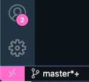
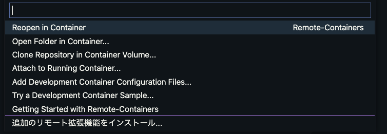

# Go

## 開発環境構築

vscode の remote container を使用することが出来ます。  
開発環境をコンテナで用意するため、ホストで環境構築する必要がありません。  
また環境構築も数クリック、数分で終わります。

### vscode の remote container の使う場合

1. 以下の拡張機能をインストールします。

   ```text
   vscodeの名前: Remote - Containers
   ID: ms-vscode-remote.remote-containers
   説明: Open any folder or repository inside a Docker container and take advantage of Visual Studio Code's full feature set.
   バージョン: 0.202.5
   パブリッシャー: Microsoft
   VS Marketplace リンク: https://marketplace.visualstudio.com/items?itemName=ms-vscode-remote.remote-containers
   ```

1. 画面左下にピンク背景の><のようなボタンが追加されるので押します

   

1. 選択肢が画面上部に出てくるので、Reopen in Container を選択します

   

1. コンテナが起動します。初回起動時はビルドするので少し時間がかかります。待ってれば OK です。

1. 起動すると通常の vscode と同じように使用できます。コンテナ内のシェル操作は vscode のターミナルを使用することでできます。

1. ホスト環境に戻りたい場合は、手順 2 で押したピンクのボタンを押し、Reopen Folder Locally を選択します。

1. .devcontainer 配下のファイルに変更があった場合は、remote container を起動した状態でピンクのボタンを押し、Rebuild Container を選択することで再ビルドできます。

### vscode の remote container の使わない場合

#### コンテナ内で作業する場合

1. `.devcontainer/docker-compose.yml`を起動します。
1. 立ち上がったコンテナで作業を行います。

#### ホストに環境構築する場合

1. go の v1.17.5 をインストールします。
1. `./install_tools.sh`を実行します。
1. `go mod tidy`を実行します。

## API サーバーの起動方法

docker compose を使用します。ホットリロードに対応しています。  
事前にインフラを起動してください。

- サーバーの起動：`make run-api`
- サーバーの停止：`make run-api-down`
- イメージの再ビルド（キャッシュを無視する）：`make run-api-build`

## lint

開発環境において、`make lint`を実行します。

## テスト

開発環境において、`make test`を実行します。

## APi サーバー

# Go

## ディレクトリ構成

ドメイン駆動設計をベースに構成しています。

```text
.
├── build
│   └── api
├── cmd
│   ├── api
│   │   └── v1
│   └── batch
│       └── samplebatch
│           └── lambda
├── internal
│   ├── app
│   │   ├── api
│   │   │   └── v1
│   │   │       ├── config
│   │   │       ├── handler
│   │   │       ├── infrastructure
│   │   │       │   └── echo
│   │   │       ├── openapi
│   │   │       └── util
│   │   │           └── di
│   │   └── batch
│   │       └── samplebatch
│   │           ├── handler
│   │           └── util
│   │               └── di
│   └── pkg
│       ├── config
│       ├── domain
│       │   ├── model
│       │   ├── repository
│       │   ├── service
│       │   └── usecase
│       ├── infrastracture
│       │   ├── ent
│       │   ├── entmysql
│       │   └── firebase
│       └── util
├── script
└── test
    └── testdata
```

- cmd

  各アプリケーションのエントリーポイント（最初に実行する関数）です。パッケージは main です。`internal/app/.../handler`を実行します。

- internal

  - app

    アプリケーションごとにディレクトリ・パッケージをきります。

  - pkg

    アプリケーション間で共通のコードを書きます。
